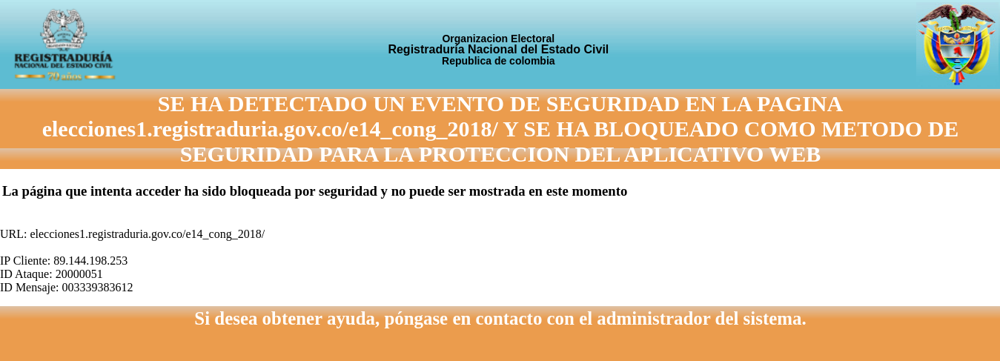

### scraping E14
* setup
```shell
# chromedriver installation
CHROMEDRIVER_VERSION=`curl -sS chromedriver.storage.googleapis.com/LATEST_RELEASE` && \
    wget https://chromedriver.storage.googleapis.com/$CHROMEDRIVER_VERSION/chromedriver_linux64.zip
sudo unzip chromedriver_linux64.zip -d /usr/bin
sudo chmod +x /usr/bin/chromedriver

# python venv
python -m venv .venv
source .venv/bin/activate
pip install -r scraping_forms/requirements.txt
```
* scrape E14
```shell
DATA_PATH=<some-where>/colombia_election_forms python scraping_forms/run_e14_scraper.py
```
#### just one example

#### scraping does NOT work in headless mode!

* TODO: find out how to prevent being detected

### current status
```shell
ls e14_cong_2018/data/ | wc -l
104053
# website says: "Publicadas: 	104,073 ", so there are still 20 missing!

du -sh e14_cong_2018/data/
31G     e14_cong_2018/data/

ls esc_cong_2018/data/ | wc -l
6845
-> not sure how many missing!!

du -sh esc_cong_2018/data/
82G     esc_cong_2018/data/
```